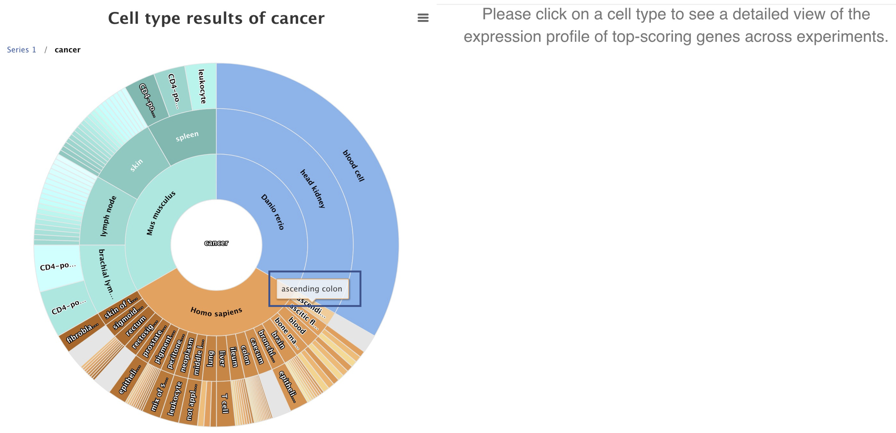

## Welcome to Single Cell Expression Atlas help

### EBI Train Online:  
[Life cell by cell: Introduction to Single Cell Expression Atlas](https://www.ebi.ac.uk/training/online/course/life-cell-cell-introduction-single-cell-expression-atlas)

### How to search in Single Cell Expression Atlas

There are two main search windows in Single Cell Expression Atlas (SCEA) – on the Home page and in the Gene search tab.
 
The Home page search window allows searches using either gene names or symbols directly or metadata queries (e.g. a cell type name, disease, organism part), Gene search tab allows gene searches only.

**Gene searches** allows you to discover whether a genea gene comprises part of a cell type expression profile. You may search its gene ID via its gene symbol or name (e.g. _APOA2_). A dropdown box will appear showing related gene symbols and species-specific results to choose from.

You can also specify which species (e.g. _Mus musculus_) you are interested in. Use the **Species drop down** to specify your organism of interest. Once your selection is made, searching for a gene ID will restrict suggestions to the specified species.

#### Gene Search Results

Once you have selected the gene symbol of interest click **Search** and this will load a new page of all experiments where your selected gene is expressed.

Search results can be filtered using the selection criteria along the left hand side of the search results page. Selecting a filter criteria will remove all non-applicable experiments from the search results. For example: selecting**Species: Homo sapiens** will show only human experiments, similar to searching only on the human specific gene symbol in the Home page Search bar. You can also select experiments where your gene of interest is expressed only in a particular **Organism part**or **Inferred cell type** by selecting these from the relevant drop-down menus.

Additionally, by clicking on the **"Marker gene"** filter you can return search results based on whether your gene of interest comprises part of the specific expression profile for a cluster.

**Metadata search** allows you to find cell type expression profiles from experiments with matching annotations. This can be for example a disease term, a particular cell type or tissue/organ that you’re interested in. Start by typing your search term, e.g. ‘cancer’,  into the main page search box and select a term from the autocomplete options that appear below.
 

 
#### Metadata Search Results
 
Once you’ve entered your keyword and clicked the ‘Search’ button, the Cell Type Wheel, an interactive visualization tool, will appear. If you haven’t specified any particular organism, the wheel will display results from all organisms for which there is relevant data in SCEA. Hovering over any section of the wheel will display the full label.
 

 
Clicking on any section of the inner rings (e.g. Homo sapiens ‘brain’) of the wheel will filter and reorganise the display to show just that subset of the results. You can navigate the results display and go back to the previous display(s) using the query Path above the wheel.

Clicking on a particular cell type (e.g. ‘astrocyte’) in the outermost ring of the wheel will bring up a Cell Type Marker Gene heatmap.
 

 
The heatmap displays the top five marker genes for your selected cell type in each experiment in SCEA that contains the relevant data. Clicking on the experiment accession number will take you to that experiment’s page. You can download the cell type marker gene heatmap either as an image file or as a spreadsheet using the Download button.

### Featured and Latest Experiments

Here, you can toggle between featured experiments and the latest experiments added to the Single Cell Expression Atlas.

#### Latest Experiments

This is a list of the latest experiments added to the Single Cell Expression Atlas, their title and upload date. You can click on the **Results** link or the experiment title to jump directly to the results page for that dataset. The number of assays is related to the number of sequencing runs. This is not equivalent to the number of cells as some cells do not pass sequencing file quality checks or you can have multiple sequencing runs or libraries generated from the same cell (technical replicates).

In order to view the full list of experiments in the Single Cell Expression Atlas click on the **Browse Experiments** tab along the top of the page.

### Browse Experiments

This page shows you an updated list of all the experiments currently available in the Single Cell Expression Atlas.

The table allows you to quickly browse, filter and download experiment data.

1.  Searchable headers: type in your species or a keyword of interest to filter the table results
2.  Download experiments: click on the checkbox next to your datasets of interest and click on the _Download_ link on the table header to download a bundle (see tooltip) for those experiments
3.  Quick links: click on the title to jump directly to the [results tab](#results-tab) in the experiment page, or the assay number to go the the [experiment design tab](#experiment-design-tab)

### Experiment page

Each experiment in Single Cell Expression Atlas has its own **experiment page**, just click on the title of any experiment to view it. At the top of the results page you will see the title of the experiment, the type of experiment and species information.

Below the experiment information you will find a list of any associated publication(s).

The Experiment page is comprised of four sections:

1.  Results: this is where you can visualise the t-SNE plots (clustering and gene expression) as well as the marker gene heatmap of the data
2.  Experiment Design: this is where you can find the simplified sample metadata for the experiment
3.  Supplementary Information: here you can find the data analysis pipelines and corresponding documentation
4.  Downloads: links to the raw data files; analysis results and sample metadata files

#### Results tab

Here you can view the results of the data analysis. This comprises of two visualisation methods: t-SNE plots and the marker gene heatmap. The t-SNE plots display subpopulations within the data and on the left and gene expression variation at single-cell resolution on the right. Each plot can be saved by clicking on the drop down menu symbol at the top right-hand side of the plot.

##### t-SNE plot with clusters

These are found in the **t-SNE plots** tab under **Results**. [t-SNE plots](https://lvdmaaten.github.io/tsne/) are a useful way of visualising highly complex data in a 2D space. Although the size and distance between clusters is not very informative, manipulating the t-SNE perplexity value allows you to re-display the data in different ways.

The number of clusters (_k_ value) shows the output of the [Scanpy clustering algorithm](https://scanpy.readthedocs.io/en/latest/api/scanpy.api.tl.louvain.html). Scanpy clusters cells into subgroups using the Louvain algorithm. This also colours the data to allow easier visualisation of different sub-populations within a dataset.

It is also possible to colour the clusters by metadata! The colour legend for each group of cells is displayed along the bottom of the t-SNE plot. The metadata used to colour the clusters is derived from different experimental groups described by the authors. This is displayed in the **Experiment Design** tab along the top of the results page.

You can hover over a single data point (cell) and a tool-tip will pop up. This displays the **single cell identifier** (a unique reference for that cell) and the **cluster ID** (which other cells share similar gene expression profiles). Additional information can include **cell type**: submitted cell type prior to sequencing analysis and/or the **inferred cell type**: cell type inferred by sequencing analysis based on gene expression profile.

t-SNE plots are calculated at a range of perplexities by the analysis pipeline. The central value is selected by default. Clustering is performed over range of values for resolution in Louvain clustering by Scanpy (producing variable numbers of clusters), and by default the number of clusters corresponding to the default resolution of 1 is selected.

##### t-SNE plot with gene expression

Use the **Gene search box** to search whether a gene comprises part of a cells' expression profile.

Expression levels are displayed as CPM (counts per million) and broken down into four different, logarithmic colour ranges:

1.  Grey spot: expression level is below cutoff (0.1 CPM) or undetected
2.  Light blue spot: expression level is low (between 0.1 to 10 CPM)
3.  Medium blue spot: expression level is medium (between 11 to 1000 CPM)
4.  Dark blue spot: expression level is high (more than 1000 CPM)

##### Marker Gene heatmap

Genes which comprise part of the specific expression profile for a cell population (cluster) are defined as **marker genes**. These are displayed - 5 per cluster in the **Marker Genes** tab under **Results**. Along the top of the page, you can specify the number of clusters or to view only a subset of clusters. As with the t-SNE plots, the heatmap can also be saved either an image or you can also directly download the data as expression values for each gene per cluster.

#### Experiment Design tab

This tab displays the **Experiment design file** – a simplified table of the the sample metadata and experimental variables. **Sample characteristics** are generally intrinsic metadata required to understand each sample. **Experimental variables** are usually one or several sample characteristics that describe the experiment groups defined by the study aim. You can browse by row (each row is a single cell). You can also sort each column by clicking on the header row of your attribute of interest. Traverse the data by indicating the number of rows to view at the bottom and by clicking on the **Previous** and **Next** buttons.

You can download the file either via the **Download** button or along with the other data and results files by selecting the **Downloads** tab (see below).

#### Supplementary Information tab

Here you can see the **Analysis Methods** applied to the raw data to obtain the clustering and gene expression results.

#### Downloads tab

The Downloads tab contains all the files that you can download:

1.  **Metadata files:**
    1.  SDRF file (Sample to Data Relationship Format) - [Creating an SDRF](https://www.ebi.ac.uk/arrayexpress/help/creating_a_sdrf.html)
    2.  IDF file (Investigation Design Format) - [Creating an IDF](https://www.ebi.ac.uk/arrayexpress/help/creating_an_idf.html)
    3.  Experiment design file containing the sample characteristics and experiment variable summary table
2.  **Results files:**
    1.  Clustering file: output of Scanpy analysis for clustering of filtered cells for the different _k_ values [(Scanpy clustering algorithm)](https://scanpy.readthedocs.io/en/latest/api/scanpy.api.tl.louvain.html)
    2.  Filtered quantification file: provides the measured gene expression in CPMs for each filtered cell alongside gene and cell ID
    3.  Marker gene files: expression values for each marker gene per cluster
    4.  Normalised counts files
    5.  Raw quantification files
